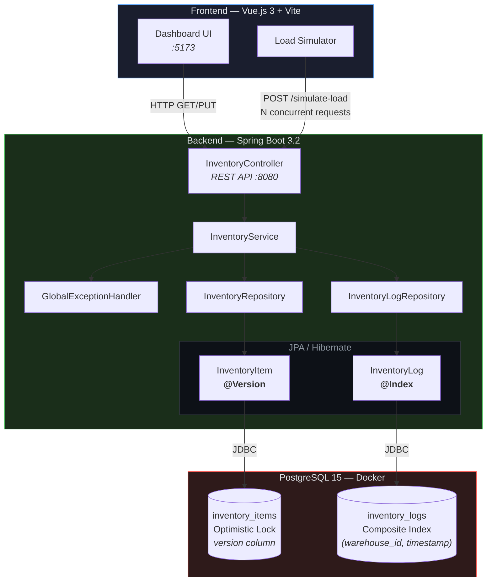
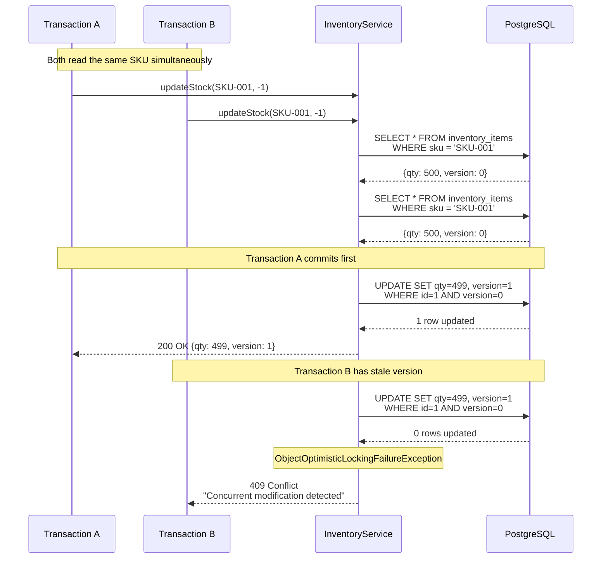
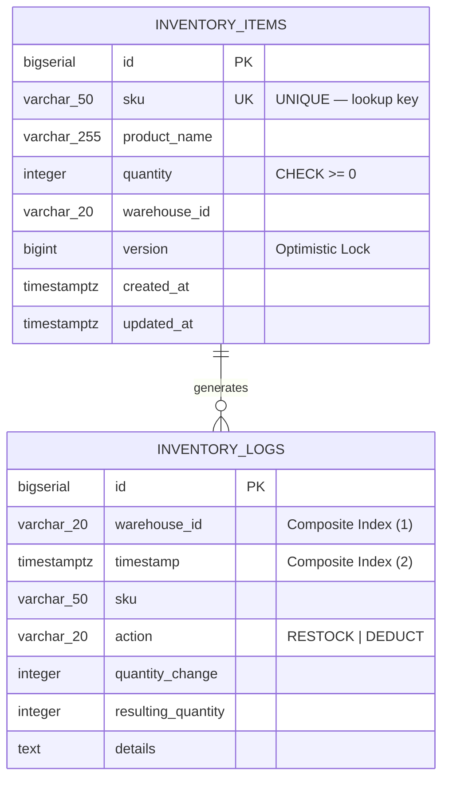
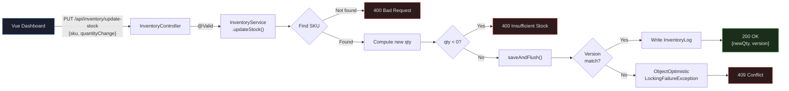
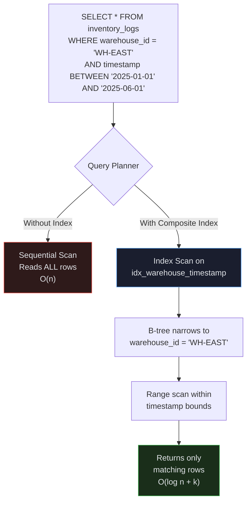

# Distributed Inventory Logistics Engine

A full-stack inventory management system built to demonstrate production-grade concurrency handling and database optimization techniques.

## Tech Stack

| Layer     | Technology                          |
|-----------|-------------------------------------|
| Backend   | Java 17, Spring Boot 3.2, JPA       |
| Frontend  | Vue.js 3, Vite                      |
| Database  | PostgreSQL 15                        |
| Infra     | Docker Compose                       |

---

## System Architecture



---

## Optimistic Locking — Sequence Diagram

Shows what happens when two concurrent transactions attempt to update the same SKU:



---

## Database Schema — ER Diagram



---

## Request Flow

How a stock update travels through the application layers:



---

## Composite Index — Query Performance

Illustrates how the B-tree composite index avoids full table scans:



---

## Key Technical Features

### 1. Concurrency Handling — Optimistic Locking

The `InventoryItem` entity uses JPA's `@Version` annotation to implement optimistic locking. When two concurrent transactions attempt to update the same SKU:

1. Both transactions read the entity (including its current `version`).
2. The first transaction to commit increments the version and succeeds.
3. The second transaction detects a version mismatch and throws `ObjectOptimisticLockingFailureException`.
4. The service layer catches this and returns an HTTP `409 Conflict` response.

**Why this matters:** In a distributed warehouse environment, multiple systems may try to adjust stock simultaneously. Optimistic locking prevents silent data corruption (e.g., overselling) without the throughput penalty of pessimistic database locks.

**Try it yourself:** Click **Simulate High Load** in the dashboard to fire 20 concurrent deduction requests against a single SKU. The results panel shows how many succeeded vs. how many were safely rejected.

```
Entity: backend/src/main/java/com/inventory/engine/entity/InventoryItem.java
Service: backend/src/main/java/com/inventory/engine/service/InventoryService.java
```

### 2. High-Performance Querying — Composite Index

The `inventory_logs` table includes a composite B-tree index on `(warehouse_id, timestamp)`:

```sql
CREATE INDEX idx_inventory_logs_warehouse_timestamp
    ON inventory_logs (warehouse_id, timestamp);
```

This accelerates the most common analytical query pattern — fetching all activity for a specific warehouse within a time range. PostgreSQL's query planner uses this index for efficient range scans instead of a full table scan.

**Endpoint:** `GET /api/inventory/logs/warehouse/{warehouseId}?start=...&end=...`

```
Schema: db/init.sql
Entity: backend/src/main/java/com/inventory/engine/entity/InventoryLog.java
```

---

## Project Structure

```
├── backend/
│   ├── pom.xml
│   └── src/main/java/com/inventory/engine/
│       ├── InventoryEngineApplication.java
│       ├── config/
│       │   ├── DataSeeder.java
│       │   └── WebConfig.java
│       ├── controller/
│       │   └── InventoryController.java
│       ├── dto/
│       │   ├── ConcurrencyTestResult.java
│       │   ├── StockUpdateRequest.java
│       │   └── StockUpdateResponse.java
│       ├── entity/
│       │   ├── InventoryItem.java      ← @Version optimistic locking
│       │   └── InventoryLog.java       ← Composite index definition
│       ├── exception/
│       │   ├── GlobalExceptionHandler.java
│       │   └── StockConflictException.java
│       ├── repository/
│       │   ├── InventoryLogRepository.java
│       │   └── InventoryRepository.java
│       └── service/
│           └── InventoryService.java   ← Concurrency test logic
├── frontend/
│   ├── index.html
│   ├── package.json
│   ├── vite.config.js
│   └── src/
│       ├── App.vue
│       ├── main.js
│       └── components/
│           └── Dashboard.vue           ← Stock table + load simulator
├── db/
│   └── init.sql                        ← Schema + composite index + seed data
├── docker-compose.yml
└── README.md
```

---

## Getting Started

### Prerequisites

- Java 17+
- Node.js 18+
- Docker & Docker Compose (for PostgreSQL)

### 1. Start PostgreSQL

```bash
docker compose up -d
```

This starts a PostgreSQL instance and runs `db/init.sql` to create tables, indexes, and seed data.

### 2. Start the Backend

```bash
cd backend
./mvnw spring-boot:run
```

The API will be available at `http://localhost:8080`.

### 3. Start the Frontend

```bash
cd frontend
npm install
npm run dev
```

The dashboard will be available at `http://localhost:5173`.

---

## API Endpoints

| Method | Endpoint                                  | Description                              |
|--------|-------------------------------------------|------------------------------------------|
| GET    | `/api/inventory`                          | List all inventory items                 |
| GET    | `/api/inventory/warehouse/{id}`           | Items by warehouse                       |
| PUT    | `/api/inventory/update-stock`             | Update stock (optimistic locking)        |
| POST   | `/api/inventory/simulate-load`            | Fire concurrent requests for testing     |
| GET    | `/api/inventory/logs`                     | Recent activity logs                     |
| GET    | `/api/inventory/logs/warehouse/{id}`      | Logs by warehouse + time range (indexed) |
| POST   | `/api/inventory/seed`                     | Load seed data                           |

---

## Architecture Decisions

- **Optimistic over pessimistic locking:** Optimistic locking allows high read throughput since no rows are locked during reads. Conflicts are rare in practice and are handled gracefully at the application layer.
- **Composite index column order:** `(warehouse_id, timestamp)` is ordered to match the most selective filter first (warehouse narrows the result set), followed by the range predicate (timestamp).
- **JPA `ddl-auto=update`:** Used for development convenience. In production, schema migrations should use Flyway or Liquibase with the provided `init.sql` as the baseline.
